# minitorch
The full minitorch student suite. 

To access the autograder: 

* Module 0: https://classroom.github.com/a/qDYKZff9
* Module 1: https://classroom.github.com/a/6TiImUiy
* Module 2: https://classroom.github.com/a/0ZHJeTA0
* Module 3: https://classroom.github.com/a/U5CMJec1
* Module 4: https://classroom.github.com/a/04QA6HZK
* Quizzes: https://classroom.github.com/a/bGcGc12k

# Task0_5:
"Simple": 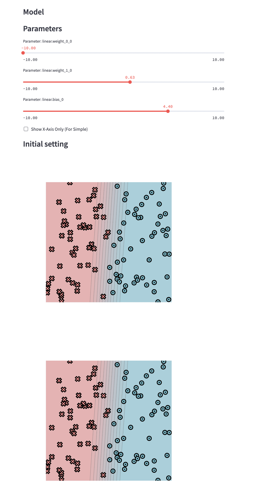
"Diag": 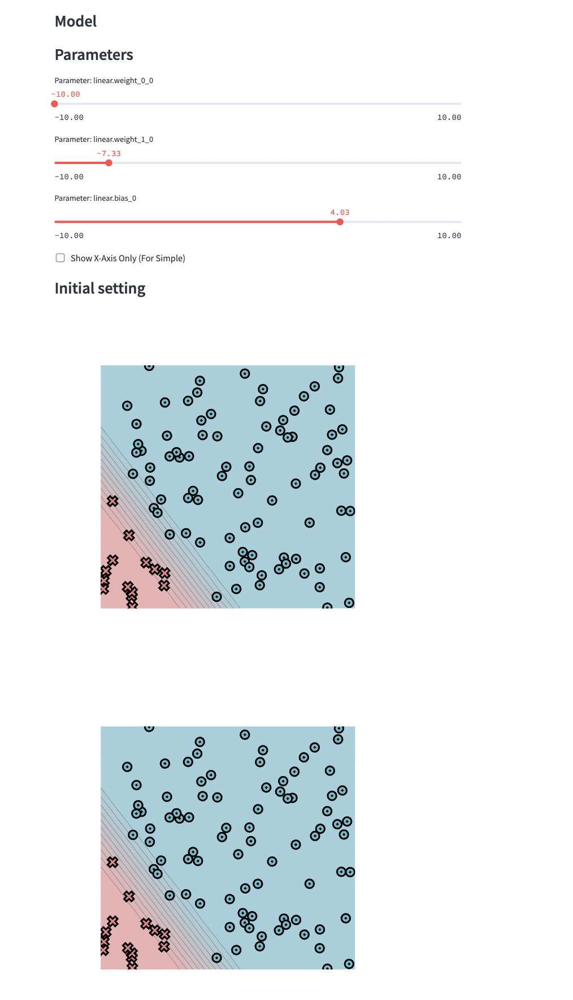
"Split": 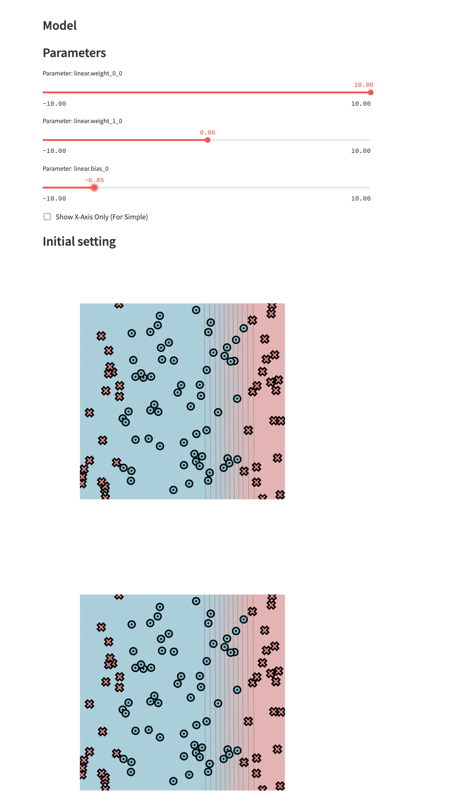
"Xor": 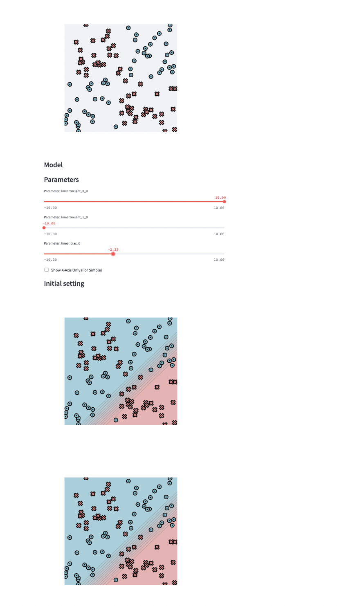
"Circle": 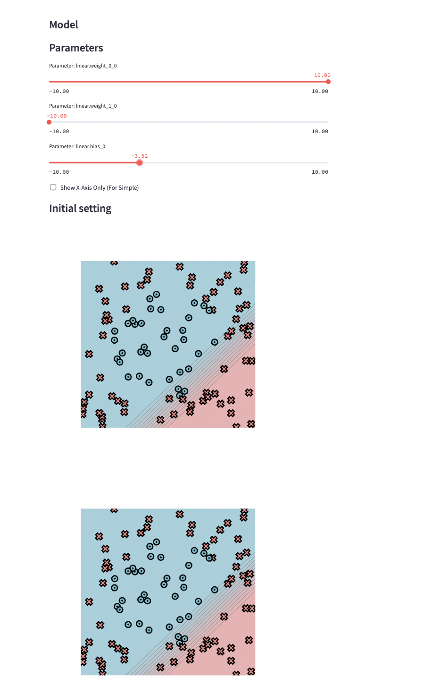
"Spiral": 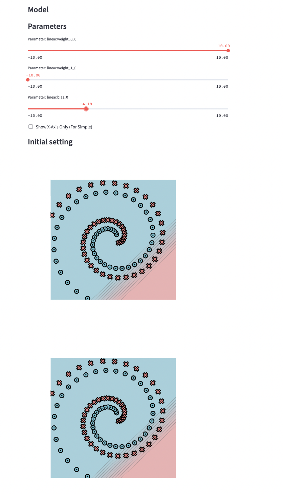
# Task1_5:
"Simple": 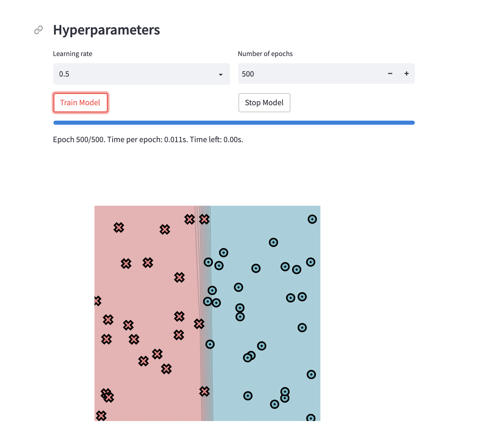
"Diag": 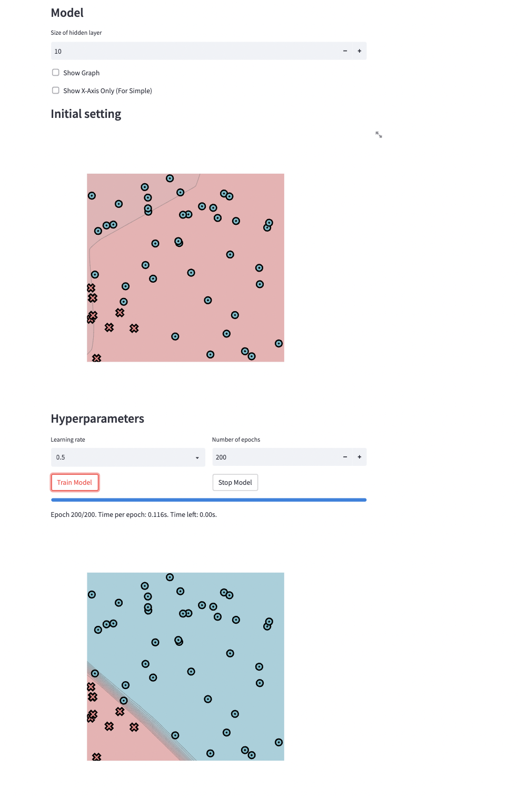
"Split": 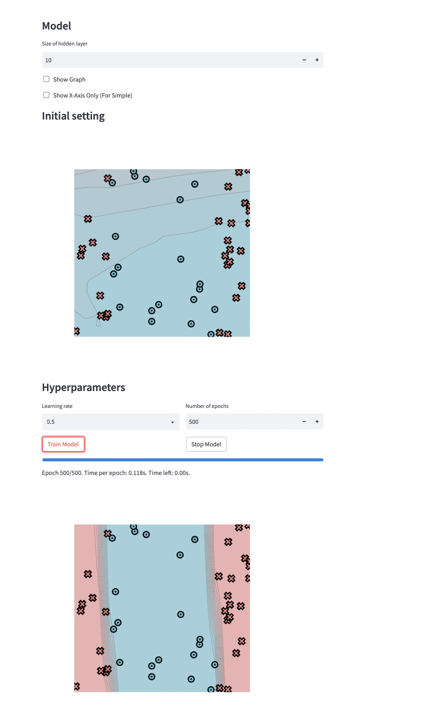
"Xor": 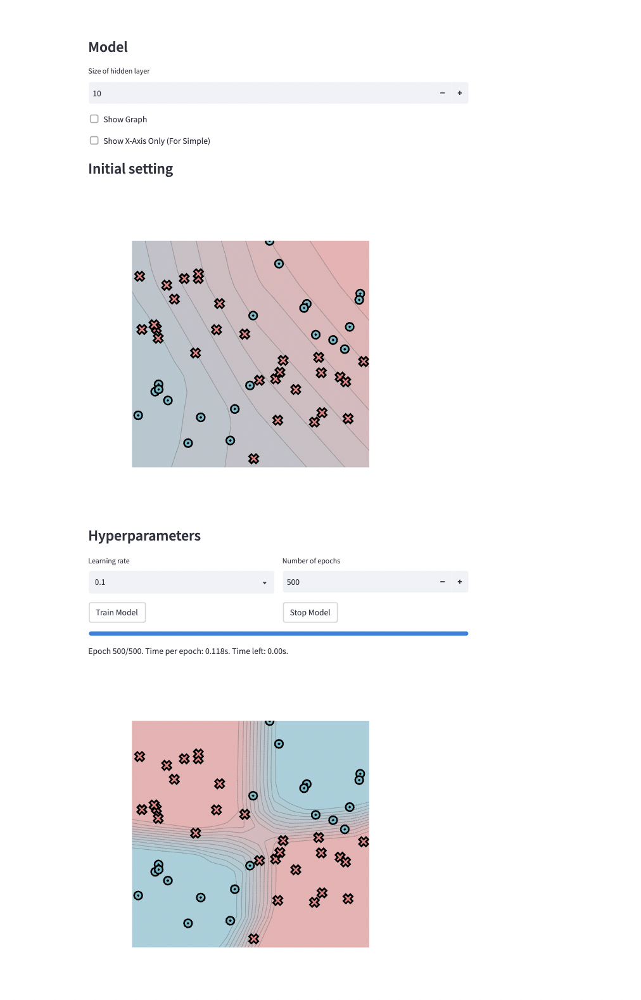
"Circle": 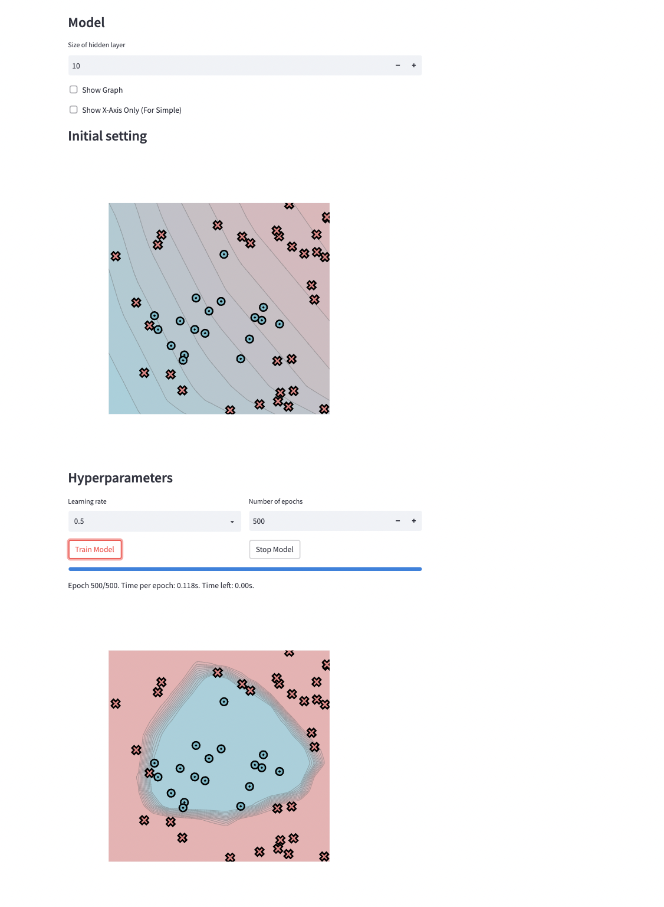
"Spiral": 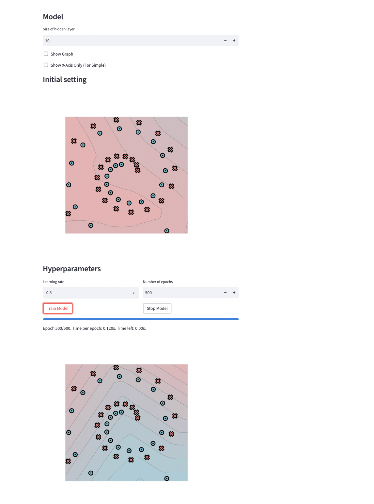
# Task2_5:
"Simple": 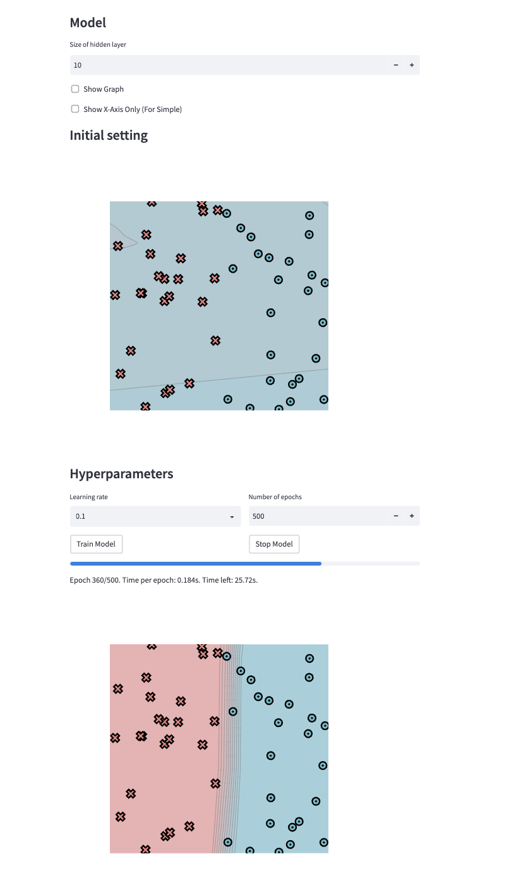
"Diag": 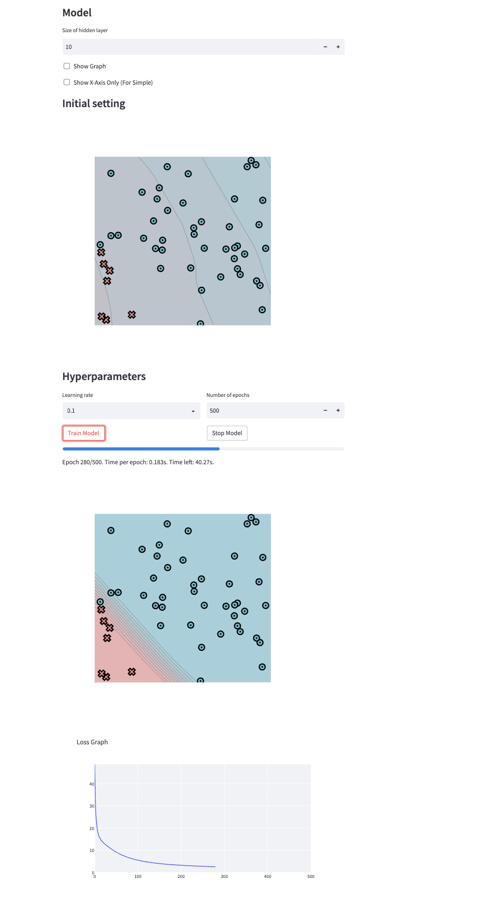
"Split": 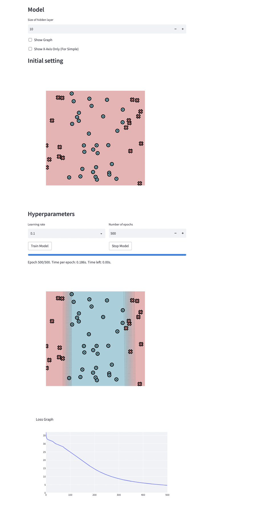
"Xor": 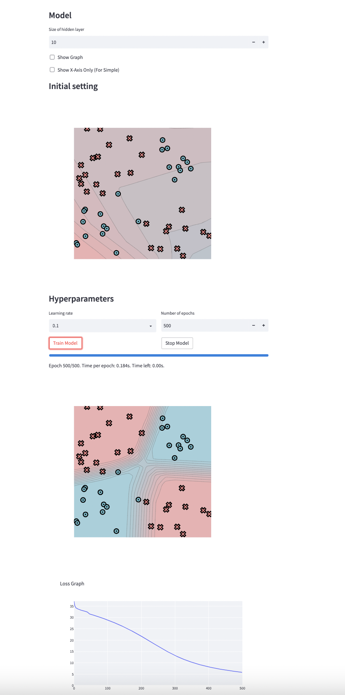
"Circle": 
"Spiral": 